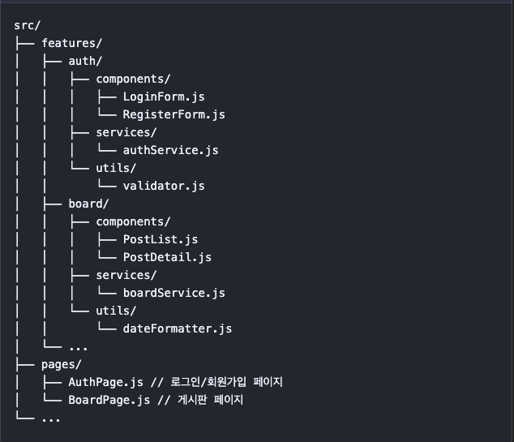
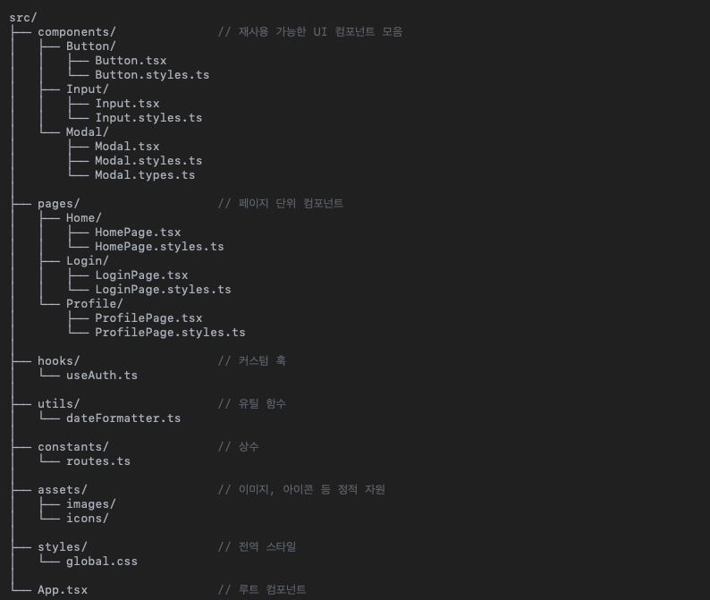
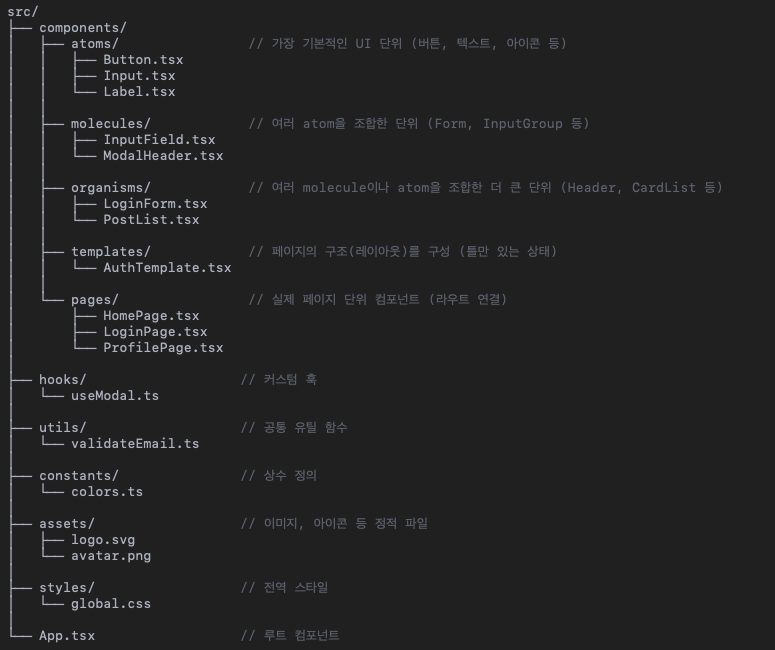
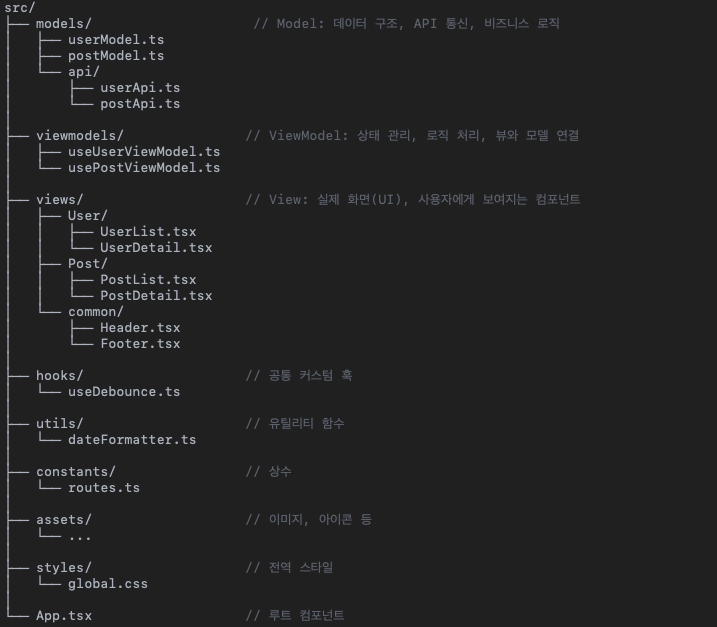

# 리액트 애플리케이션 구조

폴더 구조를 신경 써야 하는 이유는, 잘 갖춰진 구조는 유지보수하기 쉽고, 새로운 팀원이 합류했을 때 이해하기 쉽고 기능을 확장하기 쉬운 덕분에 프로젝트 성공에 전반적인 영향을 끼치게 됩니다. 반면에 비효율적인 구조는 코드 스멜을 유발시키고 코드 복잡도를 높이며 기술 부채의 온상이 되기 쉽습니다.

- 구조화되지 않은 프로젝트의 문제점
- 프론트엔드 애플리케이션의 복잡함에 대한 이해
- 일반적인 리액트 애플리케이션 구조
- 프로젝트 구조를 체계적으로 유지하기

## 3.1 구조화되지 않은 프로젝트의 문제점

짧은 기간 동안 갑자기 규모가 커진 프로젝트는 통제 불능 상태에 빠지기 쉽습니다. 새로운 프론트엔드 프로젝트를 초기에 구성하는 것은 대부분 간단하며, 소규모 프로젝트의 경우 관리할 파일 수가 적기 때문에 파일 구조에 대해 우려할 것이 별로 없습니다.

구조화가 덜 된 프로젝트의 문제점은 코드베이스를 효과적으로 관리하고 유지보수가 어렵다는 것입니다.

- **무질서한 코드**: 명확한 구조가 없으면, 특정 코드 파일이나 컴포넌트를 찾는 것이 어려워집니다. 특히 프로젝트가 커질수록 관련 코드를 찾는 시간과 노력을 낭비할 수 있습니다.
- **낮은 코드 재사용성**: 적절한 구조가 없다면, 재사용할 수 있는 컴포넌트나 기능을 식별하는 것이 쉽지 않습니다. 이는 코드 중복과 일관성 부족으로 이어질 수 있으며, 장기적으로 코드베이스를 유지하고 업데이트하기가 어려워집니다.
- **협업의 어려움**: 구조화가 덜 된 프로젝트를 진행하다 보면 팀원들이 서로의 코드를 이해하고 탐색하는 것이 더 어려워집니다. 이로 인해 의사소통, 느린 개발 속도, 그리고 버그나 코드 변경 충돌을 일으킬 위험이 있습니다.
- **확장성 문제**: 프로젝트가 커지고 새로운 기능이 늘어날수록 또 다른 구성 요소를 원활하게 기존 코드에 통합하는 것이 어려워집니다. 확장과 수정이 어려운 꼬인 코드베이스가 되기 쉽고 생산성 감소와 개발 시간 증가로 이어집니다.
- **복잡한 유지보수 문제**: 명확한 구조가 없는 코드베이스는 유지보수하기 어렵습니다. 코드를 구성하거나 이름 짓는 방식에 일관성이 부족하므로 기능을 변경하거나 문제를 해결할 때 더 많은 시간이 소요됩니다.

## 3.2 프론트엔드 애플리케이션의 복잡함에 대한 이해

리액트 프로젝트의 폴더 구조는 일반적인 리액트 코드베이스에서 관리해야 할 다양한 측면을 보여줍니다.

- **소스 코드**: 애플리케이션의 핵심이며, 애플리케이션의 로직을 담고 있는 자바스크립트 또는 타입스크립트 파일, UI 구조를 위한 HTML 파일, 디자인을 표현하는 스타일 파일이 있습니다. 애플리케이션의 동작과 사용자 인터페이스를 정의하는 모든 것은 여기에서 찾을 수 있습니다.
- **에셋**: 이 카테고리에서는 애플리케이션에서 활용하는 이미지, 비디오, 폰트와 같은 모든 정적 파일이 있습니다. 이 파일들은 애플리케이션의 시각적 경험과 상호작용을 위해 필요하며, 전박적인 룩 앤드 필에 기여합니다.
- **설정**: 이 파일들은 애플리케이션의 다양한 부분을 제어하는 중요한 매개변수를 포함합니다. 의존성 목록을 관리하는 package.json과 프로젝트를 빌드할 때 필요한 환경변수는 애플리케이션을 운영하고 배포하는 데 중요합니다.
- **테스트**: 이 영역은 애플리케이션의 올바른 동작과 안정성을 위해 필요합니다. 사용자 동작을 재현하고 상호작용을 검증하며 애플리케이션의 기능을 확인하는 유닛, 통합, E2E 테스트를 담고 있습니다. 이는 잠재적인 버그를 예방하는 데 도움이 됩니다.
- **문서**: 프로젝트 개요를 제공하는 README 파일, API 문서와 코드 스타일 가이드 등 애플리케이션에 필요한 모든 정보가 문서에 있습니다. 프로젝트와 연관된 사람들은 문서를 통해 프로젝트를 쉽게 이해하고 코드의 일관성을 유지할 수 있습니다.
- **빌드 결과물**: 배포 가능한 최적화된 번들 자바스크립트, CSS, HTML 그리고 디버깅에 도움이 되는 진단 파일과 임시 파일들을 포함한 빌드 실행 결과물입니다. 애플리케이션을 최종 사용자에게 전달하는 핵심 요소입니다.
- **개발 도구와 설정 파일**: 코드의 품질과 일정한 포맷을 유지하고 형상을 관리하여, 자동화된 테스팅과 배포 절차를 쉽게 해주는 도구입니다. 백그라운드로 작업이 수행되며, 원활하고 오류가 없는 효율적인 개발 과정을 만들어줍니다.

이러한 다양한 구성 요소는 전형적인 리액트 코드베이스의 기초를 이루며, 중간 규모의 프론트엔드 프로젝트의 복잡함과 고려해야 할 사항들에 대해 잘 보여줍니다.

코드 요소의 이름을 짓고 구조화할 때는 일관성을 유지하는 것이 가장 중요합니다. 어떤 방식을 선택하든, 프로젝트 전반에 걸쳐 일관된 방식을 유지해야 합니다. 예를 들어 스타일 파일을 컴포넌트와 함께 배치하기로 정했다면, 이를 코드베이스의 모든 컴포넌트에 적용해야 합니다.

## 3.3 일반적인 리액트 애플리케이션 구조

큰 규모의 리액트 애플리케이션의 구조를 만드는 방법 중 자주 사용되는 4가지 구조는

- 기능 기반 구조
- 컴포넌트 기반 구조
- 아토믹 디자인 구조
- MVVM 구조

구조마다 각각의 장단점이 있으므로, 프로젝트마다 필요한 기능이나 복잡도를 파악하여 어떤 구조를 사용할지 결정해야 합니다.
프로젝트에 필요한 특별한 기능이 있다면, 여러 개의 구조를 적절히 섞는 방법도 있습니다.

### 3.3.1 기능 기반 구조

기능 기반 구조란 애플리케이션을 기능과 모듈 중심으로 구조화하는 것을 의미합니다.
기느 단위로 명확하게 분리하기 위해 컴포넌트와 뷰, API 호출, 상태 관리를 캡슐화하여 관리합니다.

이 구조의 장점은 다음과 같습니다.

- **명확한 관심사 분리**: 각 기능과 관련된 코드를 쉽게 찾고 수정할 수 있습니다.
- **모듈화**: 기능 단위로 코드가 모여 있으므로 코드 테스팅과 유지보수, 재사용이 쉽습니다.
- **확장성**: 새로운 기능이 추가될 때 기존 코드에 영향을 주지 않습니다.
- **팀 협업**: 여러 기능을 개발자들이 동시에 작업할 때 코드 충돌을 최소화할 수 있습니다.

이 구조의 단점은 다음과 같습니다.

- **코드 중복의 가능성**: 기능들이 비슷한 컴포넌트나 로직을 갖고 있으면 코드 중복이 발생할 수 있습니다. 신중하게 설계하거나 리팩터링을 통해 이를 피해야 합니다.

### 3.3.2 컴포넌트 기반 구조

컴포넌트 기반 구조는 애플리케이션을 재사용할 수 있는 컴포넌트 단위로 구조화하는 것입니다. 컴포넌트는 기능 단위로 분류하고 이를 조합하여 더 큰 뷰를 만듭니다.

이 구조의 장점은 다음과 같습니다.

- **모듈화**: 컴포넌트 기반 구조는 기능 단위의 컴포넌트를 별도의 파일과 폴더에 구분하여 모듈화합니다. 이로 인해 코드를 유지보수학 쉽고 재사용성이 높아집니다.
- **관심사 분리**: 컴포넌트의 개별 기능에 집중하게 되어 코드가 간결해지고 디버깅하기 쉽습니다. 관심사를 분리하면 유지보수하기 쉽고 코드 가독성이 높아집니다.
- **높은 코드 재사용성**: 애플리케이션의 여러 곳에서 컴포넌트를 재사용하고, 이후 또 다른 프로젝트에서도 활용하여 개발 생산성을 높일 수 있습니다.

이 구조의 단점은 다음과 같습니다.

- **프로젝트 복잡도 증가**: 프로젝트가 커질수록 컴포넌트 폴더 구조가 복잡해지고 단순하게 유지하기 어렵습니다. 관리 가능한 수준을 유지하기 위해서는 모범사례를 참고하여 신중하게 설계하고 계획을 세워야 합니다.
- **높은 진입장벽**: 컴포넌트 기반의 개발과 타입스크립트에 익숙하지 않다면 초기 학습 곡선이 가파르게 올라갑니다. 하지만 초기 학습에 드는 비용보다 구조화된 코드가 가져다 주는 장점이 더 많습니다.
- **코드 중복의 가능성**: components 폴더 안에서는 다른 컴포넌트와 동일하거나 기능이 유사한 컴포넌트를 찾기 쉽습니다. 컴포넌트를 더 잘게 나눌수록, 재사용할 수 있는 컴포넌트를 찾기 쉬워질 것입니다. 재사용할 수 있는 컴포넌트가 점점 늘어난다면, 기능 기반 구조에서 보았던 대로 공유 폴더로 옮겨보는 것에 대해 고려해 볼 수 있습니다.

### 3.3.3 아토믹 디자인 구조

아토믹 디자인은 사용자 인터페이스를 체계화하는 디자인 방법론입니다.
사용자 인터페이스를 원자라고 부르는 재사용 가능한 작은 단위로 나누고 이를 합성하여 분자, 유기체, 템플릿, 페이지 등의 큰 단위를 만들어냅니다.

아토믹 디자인의 핵심 아이디어는 UI 컴포넌트를 만드는 체계적인 접근 방식을 설계하여 재사용성과 확장성, 유지보수성을 높이는 것입니다. 컴포넌트를 구성하고 이름을 지정하기 위한 명확한 구조를 제시함으로써 UI 코드베이스를 쉽게 이해하고 탐색할 수 있습니다.

아토믹 디자인 방법론에서 UI 컴포넌트를 어떻게 분류하는지 살펴봅시다.

- **원자**: UI를 구성하는 가장 작은 요소이며 버튼, 인풋, 아이콘 또는 레이블 등의 기본 요소들이 있습니다. 보통 단순하며 독립된 단일 기능을 가집니다.
- **분자**: 원자들을 조립하여 복잡한 UI 컴포넌트를 표현합니다. 여러 원자가 상호작용을 하여 기능 단위를 구성합니다. 폼 입력, 내비게이션 등이 있습니다.
- **유기체**: 더 커다란 컴포넌트이며 분자 또는 원자들을 결합하여 기능 영역의 UI를 표현합니다. 헤더, 사이드바, 카드 컴포넌트 등 사용자 인터페이스의 기능 영역을 표현합니다.
- **템플릿**: 본자 또는 유기체들을 배치하는 레이아웃 구조입니다. 페이지의 전반적인 구조와 UI의 기능 영역을 표시합니다.
- **페이지**: 템플릿과 유기체, 분자, 원자 등을 모두 결합한 온전한 사용자 화면 구성 전체를 의미합니다. 사용자에게 전달되는 최종 결과물입니다.

이 구조의 장점은 다음과 같습니다.

- **재사용성**: 컴포넌트를 애플리케이션 전체에서 쉽게 재사용할 수 있어 코드 효율성이 높습니다.
- **일관성**: UI 패턴과 디자인에 대한 일관된 적용이 가능합니다.
- **확장성**: 모듈화된 접근 방법을 통해 컴포넌트 기능 확장이 쉽고 신규 컴포넌트를 추가하기 용이합니다.
- **유지보수성**: 컴포넌트가 논리적으로 구조화되어 있어 찾거나 업데이트하기 쉽습니다.
- **쉬운 협업**: 아토믹 디자인 구조는 디자이너와 개발자가 UI 컴포넌트에 관해 논의할 때 공통 언어의 역할을 하므로 협업하기 쉽습니다.

이 구조의 단점은 다음과 같습니다.

- **높은 진입장벽**: 아토믹 디자인 원칙을 효과적으로 구현하려면 초반에 학습과 적응 과정이 필요합니다.
- **복잡도**: 애플리케이션이 커질수록 컴포넌트 개수가 늘어나고 그 관계가 복잡해져서 관리가 어렵습니다.
- **오버 엔지니어링**: 과도한 추상화는 필요 이상으로 구조를 복잡하게 만들기 때문에 컴포넌트 재사용성과 오버 엔지니어링 사이의 균형을 맞추는 것이 중요합니다.

### 3.3.4 MVVM 구조

MVVM 구조는 주로 사용자 인터페이스를 만드는 데 사용되는 아키텍처 패턴입니다.

- **모델**: 실제 다루는 데이터 또는 정보를 의미합니다. 데이터베이스, 파일, 웹서비스 또는 단순한 객체일 수도 있습니다.
- **뷰**: 사용자가 보면서 상호작용하는 것을 말합니다. 모델을 사용자에게 보여주는 역할을 하는 것이 사용자 인터페이스입니다.
- **뷰모델**: 대부분의 로직이 위치하는 곳입니다. 외부에 공개되는 속성과 명령이 있는 추상화된 뷰입니다. 뷰와 모델 사이의 차이를 메워주며, 모델의 데이터를 뷰가 쉽게 처리할 수 있는 형식으로 가공해줍니다. 데이터에 대한 작업을 수행하고 뷰에 어떻게 보여줄지를 결정합니다.

이 구조의 장점은 다음과 같습니다.

- **관심사 분리**: 뷰모델은 UI 컴포넌트에서 비즈니스 로직을 분리하여, 유지보수하기 쉽고 깔끔한 코드를 작성할 수 있습니다.
- **쉬운 테스팅**: 뷰모델은 실제 UI 컴포넌트 없이도 쉽게 단위 테스트가 가능합니다.
- **높은 재사용성**: 컴포넌트와 모델, 서비스는 다른 기능이나 뷰에서도 쉽게 재사용할 수 있습니다.
- **높은 확장성**: 기존에 사용하던 뷰모델에 새로운 기능이나 뷰를 쉽게 추가할 수 있습니다.

이 구조의 단점은 다음과 같습니다.

- **복잡도 증가**: MVVM 패턴을 도입하면 추상화 계층을 추가하게 되며, 특히 규모가 작다면 이로 인한 애플리케이션 복잡도가 증가합니다.
- **높은 진입장벽**: MVVM 개념과 사용법에 대한 이해가 필요합니다.

## 3.4 프로젝트 구조를 체계적으로 유지하기

기능 기반의 구조는 프로젝트 초기에 유용한 전략입니다. 프로젝트가 커지고 비슷한 패턴들이 반복되기 시작한다면, 추가 계층을 만들어 중복을 피할 수 있습니다.

초기 단계에서 페이지를 기능 단위로 구성하는 것은 일반적인 접근 방식입니다. 기능별로 폴더를 만들고 관련된 컴포넌트와 스타일, 테스트 등을 넢습니다.

### 3.4.1 초기 설계 구현하기

src 디렉터리의 초기 폴더 구조는 매우 간단하며 기능 기반 접근 방식을 따릅니다. 각 페이지 별 폴더가 구분됩니다.

하지만 프로젝트가 커질수록, 서로 다른 페이지에서 컴포넌트나 기능의 중복이 발생하게 됩니다. 이를 해결하려면 추가로 추상화 계층을 도입해야 합니다.

### 3.4.2 중복 제거를 위한 계층 추가

이렇게 계층을 추가하면, 코드베이스의 재사용성과 유지보수성을 높일 수 있습니다.
중복을 제거하고 개발 효율을 높이며 애플리케이션 전반에 걸쳐 일관성이 확보됩니다. 프로젝트가 더 커지더라도 이런 모듈화된 접근 방식 덕분에 관리와 확장이 쉽고, 전체 코드베이스에 영향을 주지 않으면서 신규 기능을 추가하거나 변경할 수 있습니다.

이러한 계층 구조를 적용하기 위해서는 모듈화된 접근 방식을 사용해야 합니다.

모든 컴포넌트를 components 폴더로 옮겨야 하는 것은 아닙니다. 여러 페이지에서 중복되는 컴포넌트만 공유 폴더로 옮겨야 하며, 모듈성과 불필요한 복잡성 사이의 균형을 유지해야 합니다.

프로젝트 구조가 커지더라도 더 나은 조직화, 코드 재사용, 쉬운 코드 확장을 가능하게 합니다.
따라서 중복을 줄이고 애플리케이션 내의 일관성을 유지할 수 있기 때문에 관리하기 쉽습니다. 또한 훅과 컨텍스트를 별도 폴더로 분리하기 때문에, 관련된 코드를 한곳에 모으고 전역 상태와 재사용하는 로직을 관리하기 용이합니다.

### 3.4.4 사용자 설정 구조 살펴보기

애플리케이션이 커지고 서로 다른 타입의 추상화 계층이 추가되면, 그에 걸맞는 프로젝트 구조화가 필요합니다.
프로젝트 요구사항에 맞춰 앞서 소개했던 구조들을 변형하는 것이 종종 필요합니다. 프로젝트 구조를 세우는 근본적인 목적은 개발 과정을 단순화하고 간소화하는 것입니다.

기능 기반의 구조에서 시작했을 때, 이러한 변화를 반영하기 위해선 현재의 폴더 구조를 다음과 같이 변경해야 합니다.

- api: 네트워크 요청을 발생시키고 응답을 다루며, 백엔드 서비스와 상호작용하는 API 관련 코드를 관리하는 모듈 또는 디렉터리 입니다.
- components: 애플리케이션에서 여러 페이지와 기능을 넘나들며 재사용 가능한 UI 컴포넌트가 있는 폴더입니다. 컴포넌트들은 기능이나 목적에 따라 서브 폴더로 다시 나뉘기도 합니다.
- context: 전역 상태를 관리하고 컴포넌트 간에 데이터를 공유하게 해주는 리액트 컨텍스트 모듈이 위치한 폴더입니다.
- hooks: 재사용 가능한 로직과 행위를 담고 있는 사용자 정의 리액트 훅이 있습니다. 이 훅은 애플리케이션의 전반에 걸쳐 공유될 수 있습니다.
- mocks: 테스팅 목적의 모킹 데이터 또는 모킹 구현체를 가지고 있습니다.
- pages: 이 폴더는 애플리케이션의 다양한 페이지나 기능이 있습니다. 페이지 또는 기능 단위로 폴더가 있습니다. 폴더에는 Address, Home, Login, Order가 있으며, 하위에 서브 폴더가 있습니다. 서브 폴더는 페이지 또는 기능에 추가로 필요한 부가적인 컴포넌트와 훅, 컨텍스트를 담고 있습니다.

이렇게 프로젝트의 구조를 세우면, 모듈화 되고 구조화된 코드베이스를 만들 수 있습니다. 이를 통해 코드 재사용성을 높이고, 관심사를 분리하고, 확장하기 쉬워집니다.
각각의 디렉터리는 애플리케이션의 특정 부분을 나타내며 코드를 더 쉽게 찾고 관리할 수 있습니다.

이 구조는 단단한 기반을 갖추고 있지만, 프로젝트의 구체적인 요구사항 또는 확장에 따라 변ㄱ경하는 것이 중요합니다. 구조를 정기적으로 리뷰하고 리팩터링하여, 효율성을 유지하고 미래의 변경 가능성에 효과적으로 대비할 수 있습니다.

애플리케이션이 커지면, components 폴더를 공용 라이브러리로 분리하여 여러 프로젝트에서 함께 사용하거나 내부 디자인시스템으로 활용하는 것이 유리할 수 있습니다.
이 전략은 코드 재사용과 일관성, 유지보수성을 높여줍니다.
