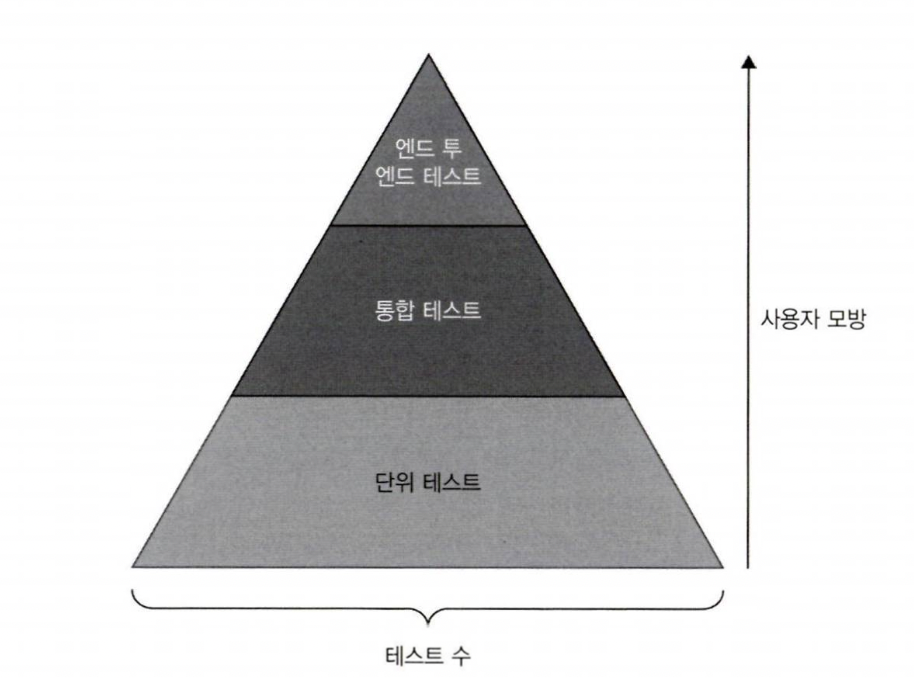

# 리액트 테스팅

- 테스트가 필요한 이유
- 여러 종류의 테스트 알아보기
- Jest로 하는 개별 단위 테스팅
- 통합 테스트
- Cypress 이용한 E2E 테스트

## 5.1 테스트가 필요한 이유

테스트는 소프트웨어의 안정성과 유지보수성을 높여주는 핵심 요소이므로 선택이 아닌 **필수**입니다.

- **코드 검증**: 테스트는 코드가 의도한 방향으로 동작하고 있음을 확실하게 알려줍니다. 함수가 주어진 입력값에 따른 결괏값을 반환하고, 컴포넌트가 올바르게 렌더링되며, 애플리케이션이 예상대로 동작하는지 테스트를 통해 확인할 수 있습니다.
- **회귀 방지**: 애플리케이션을 확장하면서 새로운 코드의 추가로 인해 기존에 잘 동작하던 기능을 깨트릴 수 있습니다. 이를 회귀라 부릅니다. 자동화된 테스트는 회귀를 잡아주는 안정망 역할을 합니다.
- **리팩터링과 유지보수의 용이성**: 리팩터링이나 레거시 코드를 업데이트하는 과정은 늘 불안하기 마련입니다. 테스트는 이러한 불안을 줄여줍니다. 업데이트나 리팩터링 과정에서 실수로 무언가를 깨트리더라도 테스트가 잡아주니 안심할 수 있습니다.
- **코드 품질에 대한 신뢰 향상**: 잘 작성된 테스트 코드가 뒷받침한다면 코드의 품질을 정량적으로 측정할 수 있습니다.
- **문서화**: 테스트는 문서로 쓰일 수 있습니다. 테스트를 통해 함수나 컴포넌트의 수행 동작을 명확히 이해할 수 있고, 새로 함류하는 팀 동료가 프로젝트의 기능 동작을 이해할 수 있습니다.

## 5.2 여러 종류의 테스트 알아보기

소프트웨어 개발 영역에서 테스트는 여러 유형으로 분류할 수 있습니다.
유형별로 고유한 목적을 갖고 있으며, 애플리케이션의 기능과 신뢰성을 뒷받침합니다. 전반적인 애플리케이션의 견고함을 위해 테스트를 유형별로 이해하는 것이 중요합니다. 보통 하나의 코드베이스에 단위 테스트와 통합 테스트, E2E 테스트가 있습니다.

- **단위 테스트**: 개별 컴포넌트나 함수의 기능을 격리하여 각각 예상대로 동작하는지를 확인합니다.
- **통합 테스트**: 다른 모듈과 서비스들이 원활하게 상호작용하여 함께 잘 동작하는지를 검사합니다.
- **E2E 테스트**: 전체 애플리케이션의 흐름을 시작부터 종료까지 실제 사용자 행동을 묘사하여 테스트합니다. 이를 통해 전체 시스템이 유기적으로 잘 동작하는지를 확인합니다.

프로젝트에서 테스트를 구성하는 방법도 중요합니다. 빠르게 수행이 가능한 단위 테스트는 많은 시나리오를 만들고 자주 실행하여 상세한 피드백을 빠르게 확인해야 합니다. 반면에 수행 시간이 많이 걸리는 E2E 테스트는 단위 테스트보다 시나리오 수는 적지만, 각 기능들이 유기적으로 동작하는지를 검증해야 합니다. 이러한 접근 방식은 테스트 피라미드 방법론과 일치합니다.



프론트엔드 애플리케이션 영역에서는 계속해서 새로운 종류의 테스트가 등장하고 있습니다. 그 중에서도 시각적 회귀 테스트는 웹 애플리케이션의 시각적으로 나타나는 부분을 저장하고 이전 버전과 비교하는 방식입니다. 사용자 인터페이스의 의도하지 않은 시각적 오류와 변경 사항이 개발 도중에 발생했을 때, 이러한 유형의 테스트가 특히 유용합니다.

시각적 회귀 테스트는 각기 다른 시점에서 웹페이지 또는 컴포넌트의 스크린샷이나 스냅샷을 찍어 픽셀 단위로 비교하여 시각적 차이점을 찾아냅니다. 차이점이 발견되었을 때는 리뷰가 필요하다고 표시합니다. 감지된 변화가 새로운 기능이나 디자인 업데이트로 인한 예상된 변화인지, 아니면 의도치 않은 변화라 수정이 필요한지 리뷰를 진행할 때 결정합니다.

프론트엔드 테스팅 방법론 중 **정적 검사**는 오류를 잡아내고 코딩 표준을 보장하기 위해 코드를 실행시키지 않고 구문을 분석하는 것입니다. 구문 오류를 체크하고, 린팅을 통한 코드 표준을 강제하고, 타입 검사를 통해 올바를 데이터 타입을 확인합니다. 또한 코드의 복잡도를 분석하고 의존성을 검사하며 보안 취약점을 확인합니다.

애플리케이션의 요구사항에 따라 테스트 피라미드의 구체적인 모양은 다를 수 있지만, 중요한 점은 애플리케이션의 다양한 영역에서 빠르고 유용한 피드백을 제공할 수 있는 균형 잡힌 테스팅 전략을 갖추는 것입니다.

## 5.3 Jest로 하는 개별 단위 테스팅

**단위 테스트**는 가장 작은 단위이면서 테스트 피라미드의 기본 토대가 됩니다. 함수, 메서드 또는 컴포넌트와 같은 기본 단위 코드가 격리된 환경에서 예상한 대로 동작을 수행하는지 검증합니다. 단위 테스트는 작성하고 실행하기 쉬우며 개발자에게 즉각적인 피드백을 제공합니다.

Jest는 페이스북에서 만든 범용 자바스크립트 테스팅 프레임워크로, 단순함에 초점을 맞춥니다. 비동기 테스트, 모킹, 스냅샷 테스팅 등을 지원하고, 기능이 풍부하여 리액트 애플리케이션을 테스트하기에 좋은 선택입니다.

### 5.3.1 첫 테스트 작성하기

math.ts 파일의 add 함수를 확인하기 위해 간단한 테스트를 작성해봅니다.

```typescript
function add(a: number, b: number): number {
  return a + b;
}
```

테스트 코드를 작성하기 위해, 같은 디렉터리에 math.test.ts 파일을 만듭니다.

```typescript
import { add } from "./math";

it("add adds numbers correctly", () => {
  expect(add(1, 2)).toBe(3);
});
```

첫 테스트 코드를 작성했습니다. test 함수는 테스트를 설명하는 문자열과 테스트를 구현한 콜백 함수, 2개의 인자를 받습니다.
**expect**는 Jest에서 제공하는 함수이며 실제 값을 전달받고, **toBe**는 비교 함수로 실제 값과 기대한 값을 비교합니다.

테스트를 작성하는 또 다른 방법은 it 함수를 활용하는 것입니다. Jest에서 test와 it 함수는 실제로 같은 함수이며 서로 번갈아 가며 사용할 수 있습니다. 각각의 이름은 서로 다른 테스팅 규칙에서 등장했습니다.

- test: 많은 테스팅 프레임워크와 언어에서 흔히 쓰이는 이름입니다. 다른 테스팅 라이브러리에 대한 경험이 있다면, test는 보다 직관적이고 익숙할 것입니다.
- it: 자스민이나 모카와 같은 행위 주도 개발 방식의 프레임워크에서 유래되었습니다.

it을 사용하면 테스트 코드를 마치 영어 문장처럼 자연스럽게 읽을 수 있습니다.
예를 들어 `it("add 1 + 2 to equal 3", () => expect(add(1, 2)).toBe(3));` 테스트 코드는 "1과 2를 더하면 3과 같다"로 읽을 수 있습니다.

BDD는 소프트웨어 개발 방법론으로 소프트웨어 프로젝트에서 개발자와 QA, 비개발자 간의 협업을 강조합니다. 개발 구현을 시작하기 전에 기대하는 행위에 대한 명확한 이해를 강조하여 개발과 비즈니스 요구사항을 일치시킵니다.

팀의 테스팅에 대한 선호와 철학에 따라 맞는 방법을 선택하면 됩니다. 테스트가 무엇을 확인하려고 하는지 비개발자 그룹에게 더 명확히 이해시키려면 it을 선택하면 됩니다. 반면에 간결하고 직관적인 것을 선호하는 팀은 test를 선택할 것입니다.

### 5.3.2 테스트 그룹 묶기

서로 관련이 있는 테스트들을 하나의 그룹으로 묶으면 테스트 파일의 가독성이 향상됩니다. 다양한 기능 영역을 명확하게 묘사함으로써, 그룹은 테스트 스위트의 맥락을 한눈에 이해하기 쉽게 합니다. 이렇게 가독성이 향상되면 어떤 기능을 검증하고자 하는지 이해하는 데 크게 도움이 됩니다. 큰 코드 단위에서 많은 수의 테스트가 있을 때, 그룹 묶기를 하면 애플리케이션의 각각 다른 부분들이 어떻게 테스트되고 있는지 한눈에 파악하기가 쉽습니다.

Jest에서는 describe 함수를 이용하여 테스트 그룹을 묶을 수 있습니다. add 함수에 음수의 덧셈, 음수와 양수의 덧셈, 십진법의 합 또는 복소수나 허수의 덧셈 등 여러 가지 계산 기능 검증이 필요한 사례를 살펴보겠습니다. 이들은 다음 코드처럼 하나의 describe 블록으로 묶는 것이 효율적입니다.

```typescript
import { add } from "./math";

describe("math functions", () => {
  it("adds positive numbers correctly", () => {
    expect(add(1, 2)).toBe(3);
  });

  it("adds negative numbers correctly", () => {
    expect(add(-1, -2)).toBe(-3);
  });
  // 그 외 테스트 코드
});
```

describe 함수는 관련된 테스트를 그룹으로 묶을 때 사용합니다. 여기서는 몇 개의 수학 함수에 사용합니다.
이 그룹 안에는 2개의 it 함수가 있는데 각각 하나의 테스트를 의미합니다. 첫 번째 테스트는 add 함수가 두 양수를 올바르게 더하는지, 두 번째 테스트는 add 함수가 두 음수를 올바르게 더하는지 확인합니다.

Jest로 describe 블록을 중첩하여 테스트를 좀 더 구조화할 수 있습니다. 예를 들어 테스트를 뺄셈과 곱셉, 나눗셈까지 확장한다고 하면, 다음과 같은 방법으로 테스트 스위트를 구조화할 수 있습니다.

```typescript
describe("calculator", () => {
  describe("addition", () => {
    it("adds positive numbers correctly", () => {
      expect(add(1, 2)).toBe(3);
    });

    it("adds negative numbers correctly", () => {
      expect(add(-1, -2)).toBe(-3);
    });
    // 그 외 추가 테스트 코드
  });

  describe("subtraction", () => {
    it("subtracts positive numbers correctly", () => {});
    // 그 외 추가 테스트 코드
  });
});
```

예제 코드에서 최상위 describe 블록은 calculator로 명명합니다. 이 블록 안에는 각각의 수학 연산 단위로 중첩된 describe 블록이 있습니다.

### 5.3.3 리액트 컴포넌트 테스트

앞서 살펴본 바와 같이 Jest는 여러 형태의 애플리케이션을 테스트하기 좋은 도구이며, 리액트 애플리케이션에 대해서도 탁월합니다. Jest를 단독으로 사용할 수도 있지만, 리액트 테스팅 라이브러리와 같은 전용 라이브러리를 사용하는 것보다 코드가 번잡해질 수 있습니다.

리액트 테스팅 라이브러리는 리액트 컴포넌트 테스팅을 위한 강력한 경량 라이브러리입니다. Jest를 기반으로 리액트 컴포넌트를 손쉽게 다루는 유틸리티 함수들이 추가된 라이브러리로, 테스트 코드를 사용자의 소프트웨어 사용 행태와 유사하게 작성하기를 권장합니다. 사용자처럼 애플리케이션과 상호작용을 하며, 세부 구현에 대한 것이 아닌 기능에 대한 테스트를 하는 것입니다. 이러한 접근 방식으로 작성한 탄탄하고 유지하기 쉬운 테스트 코드는 애플리케이션이 실서비스에서도 잘 동작할 수 있게 하는 든든한 버팀목이 될 것입니다.

Section 컴포넌트는 heading과 content 2개의 prop을 전달받아 article 태그 하위에 표시해주는 프레젠테이션 컴포넌트입니다.

```typescript
interface SectionProps {
  heading: string;
  content: string;
}

function Section({ heading, content }: SectionProps) {
  return (
    <article>
      <h1>{heading}</h1>
      <p>{content}</p>
    </article>
  );
}
```

컴포넌트를 테스트하려면 Section.tsx 옆에 Section.test.tsx 파일을 만들고, 여기에 테스트 코드를 작성할 것입니다. 리액트 테스팅 라이브러리를 이용하여 Section 컴포넌트를 확인하면 됩니다.

```typescript
import { render, screen } from "@testing-library/react";
import { Section } from "./component/Section";

describe("Section", () => {
  it("renders heading and content", () => {
    render(<Section heading="Heading" content="Content" />);

    expect(screen.getByText("Heading")).toBeInTheDocument();
    expect(screen.getByText("Content")).toBeInTheDocument();
  });
});
```

이 테스트 코드는 @testing-library/react를 사용하여 Section 컴포넌트가 예상대로 동작하는지 검증합니다.
Heading과 Content 텍스트가 HTML 문서에 표시되어야 합니다. @testing-library/react에서 제공하는 렌더링 함수는 Section 컴포넌트 안의 heading에 Heading, content에 Content prop을 전달했을 때 HTML을 렌더링합니다.

렌더링 이후에 screen.getByText 함수는 Section 컴포넌트로 렌더링된 DOM에서 특정 텍스트를 가진 요소를 조회합니다.

그 다음 expect와 toBeInTheDocument는 이 요소의 상태에 대해 단언하는 데에 쓰입니다. DOM에 Heading 텍스트가 있는 요소와 Content 텍스트가 있는 요소가 있다고 단언하여, section 컴포넌트가 heading과 content prop을 올바르게 렌더링했음을 확인합니다.

리액트 컴포넌트에 대한 직관적인 단위 테스트는 테스팅을 시작하기 좋은 지점입니다. 하지만 실전의 복잡한 프로젝트에서는 여러 개의 컴포넌트들이 조화롭게 상호작용해야 하는 상황을 만나게 됩니다. 예를 들어 하나의 결제 페이지에 배송주소 목록과 결제 정보를 입력하는 폼이 있는 경우가 그렇습니다. 이런 경우엔 더 포괄적인 테스팅 전략이 필요합니다.

## 5.4 통합 테스트

테스트 피라미드에서 단위 테스트 위에 있는 통합 테스트는 여러 단위 코드들 사이의 상호작용에 대해 검증합니다. 여기서 말하는 상호작용이란 컴포넌트 간의 상호작용 또는 서버와 클라이언트 사이의 상호작용을 말합니다. 통합 테스트의 목적은 시스템의 각기 다른 부분들을 통합하면서 생길 수 있는 문제들을 발견하는 것입니다.

리액트 컴포넌트의 통합 테스트 예제를 살펴보겠습니다. 법적인 정보를 담고 있는 긴 텍스트와 사용자 동의 여부를 표시하는 체크박스가 있다고 가정하겠습니다.
Next 버튼의 초기 상태는 비활성화 표시가 되어 있습니다. 하지만 사용자가 Accept the terms and conditions를 체크하면 버튼이 활성화되어 다음으로 넘어갈 수 있습니다.

통합 테스트는 아래 코드와 같이 구현합니다. 체크박스와 Next 버튼을 각각 테스트하지 않고 두 버튼 간의 상호작용에 대해 검증하는 것입니다.

```typescript
describe("Terms and Conditions", () => {
  it("enables next button when terms and conditions are accepted", () => {
    render(<TermsAndConditions />);
    const button = screen.getByText("Next");
    expect(button).toBeDisabled();

    const checkbox = screen.getByRole("checkbox");
    act(() => {
      userEvent.click(checkbox);
    });
    expect(button).toBeEnabled();
  });
});
```

describe 함수는 TermsAndConditions 컴포넌트와 관련된 모든 테스트들을 테스트 스위트라 불리는 그룹으로 묶습니다. 테스트 스위트 안에는 it으로 표시한 단일 테스트 케이스가 있습니다.

초기에는 TermsAndConditions 컴포넌트를 표시하기 위해 render 함수를 호출합니다. 이 함수는 컴포넌트가 예상대로 동작하는지 평가하기 위해 다양한 방법으로 조회할 수 있는 일련의 출력이나 렌더링 결과물을 생성합니다.

이후에 페이지 안에서 검색한 요소를 반환해주는 screen.getByText 함수를 이용하여 Next라는 텍스트를 통해 버튼을 찾습니다. 여기서 버튼은 비활성화되어 있어야 하는데, `expect(button).toBeDisabled()`를 통해 비활성화 상태를 확인합니다.

다음으로 체크박스를 screen.getByRole 함수를 통해 찾습니다. 이 함수는 체크박스를 checkbox라는 역할로 구분하여 찾습니다.

사용자의 체크박스 선택은 act 함수로 감싼 userEvent.click 함수를 통해 시뮬레이션합니다. act 함수는 이 동작으로 인한 모든 UI 업데이트가 완료될 때까지 기다린 후 다음 단계로 진행하므로, 테스트 과정에서 업데이트된 상태를 정확하게 확인할 수 있습니다.

마지막으로, 체크박스를 클릭한 후에 버튼이 활성화 되는 것을 `expect(button).toBeEnabled()`를 통해 확인합니다. 이 선언문이 true면 컴포넌트가 의도한 대로 동작함을 확인할 수 있습니다. 이는 사용자가 약관과 조건에 동의하기까지 Next 버튼이 비활성화되어 있음을 의미합니다.

이제 어떻게 코드를 작성하는지 봅니다. 테스트의 대상인 TermAndConditions 컴포넌트 코드는 heading, LegalContent, UserConsent와 같은 몇 가지 컴포넌트의 조합으로 구성되어 있습니다. UserConsent는 Checkbox와 Button 컴포넌트로 이루어져 있습니다.

```typescript
import React, { useState } from "react";

const TheLegalContent = () => {
  return <p>{/*...*/}</p>;
};

type CheckBoxProps = {
  label: string;
  isChecked: boolean;
  onCheck: (event: any) => void;
};

const CheckBox = ({ label, isChecked, onCheck }: CheckBoxProps) => {
  return (
    <label>
      <input type="checkbox" checked={isChecked} onChange={onCheck} />
      {label}
    </label>
  );
};

type ButtonProps = {
  type: "standard" | "primary" | "secondary";
  label: string;
  disabled?: boolean;
};

const Button = ({ label, disabled = true }: ButtonProps) => {
  return (
    <div style={{ margin: "0.5rem 0" }}>
      <button disabled={disabled}>{label}</button>
    </div>
  );
};

const UserConsent = () => {
  const [isChecked, setIsChecked] = useState(false);

  const handleCheckboxChange = (event: React.ChangeEvent<HTMLInputElement>) => {
    setIsChecked(event.target.checked);
  };

  return (
    <>
      <CheckBox
        isChecked={isChecked}
        onCheck={handleCheckboxChange}
        label="I accept the terms and conditions"
      />
      <Button type="primary" label="Next" disabled={!isChecked} />
    </>
  );
};

const TermsAndConditions = () => {
  return (
    <div>
      <h2>Terms and Conditions</h2>
      <TheLegalContent />
      <UserConsent />
    </div>
  );
};

export { TermsAndConditions };
```

이 컴포넌트에서 외부로 노출되는 컴포넌트는 TermsAndConditions 하나입니다. 이 테스트에서는 jsdom 환경에서 클릭 이벤트를 시작하기 위해 userEvent.click을 사용합니다.

중요한 것은 개별 리액트 컴포넌트에 대한 단위 테스트를 수행하는 것이 아니라, DOM요소 간의 상호작용에 초점을 맞추는 것입니다. 여기서는 모든 기능을 지원하는 브라우저를 사용하지 않고, 메모리 위에서 동작하는 헤드리스 브라우저인 jsdom을 사용합니다. 제한된 환경에서 수행하는 통합 테스트일지라도, 클릭 이벤트와 버튼 활성화가 예상한 대로 동작하는지를 확인하는 데는 충분합니다.

통합 테스트에서는 여러 다양한 모듈 사이의 상호작용에 집중합니다. 하지만 상호작용이 기대한 대로 동작하더라도 더 큰 범위의 시스템이 동작하지 않을 가능성이 있습니다. 사용자의 동작은 종종 여러 단계를 거치는 복잡한 흐름이 되기도 하므로, 소프트웨어의 안정적인 동작을 보장하기 위해 각 단계들을 매끄럽게 연결하는 과정이 중요합니다.

## 5.5 Cypress를 이용한 E2E 테스트

E2E 테스트는 테스트 피라미드의 가장 상위에 있습니다. E2E 테스트는 실제 사용자 흐름과 상호작용을 묘사하여, 시스템 전체를 테스트합니다. 이 테스트는 사용자 인터페이스부터 백엔드 시스템까지 애플리케이션의 모든 부분이 함께 잘 동작하는지를 검증합니다.

### 5.5.2 첫 E2E 테스트 실행하기

Cypress는 cypress/e2e/ 폴더 하위의 파일 변경을 추적하고, 내용이 변경되면 테스트를 수행합니다.

MacOS나 Linux 또는 Windows의 터미널 화면에서 npm cypress open 명령어를 통해 Cypress가 실행되어야 합니다.

```typescript
describe("quote of the day", () => {
  it("display the heading", () => {
    cy.visit("https://icodeit-juntao.github.io/quoto-of-the-day/");
  });
});
```

위 코드에서 describe는 테스트 스위트를 선언합니다. 여기에서는 '오늘의 명언' 기능입니다. 코드 안에서 display the heading이라는 하나의 테스트 케이스를 it으로 선언했습니다. 이 테스트 케이스의 목적은 웹사이트에 방문하는 것입니다. 이 웹사이트는 사용자가 페이지를 갱신할 때마다 무작위로 명언을 반환합니다.

그러나 이 테스트 케이스는 실제 테스트를 수행하거나 검증하는 부분이 아직 없고, 그러 페이지로 이동하는 것뿐입니다. 유용한 테스트를 만들기 위해선 제목이나 표시되는 명언 등 특정 요소의 상태를 확인하는 단언을 추가할 수 있습니다.

```typescript
it("display the heading", () => {
  cy.visit("https://icodeit-juntao.github.io/quoto-of-the-day/");
  cy.contains("Quote of the day");
});
```

이제 이 코드는 의미 있는 테스트가 되었습니다. https://icodeit-juntao.github.io/quoto-of-the-day/에 방문한 후에 cy.contains() 메서드를 통해 확인하는 로직이 추가되었습니다. cy.contains() 메서드는 특정 텍스트, 여기에서는 오늘의 명언을 포함하는 DOM 요소를 찾아 반환합니다. 이 메서드는 텍스트를 포함하는 첫 번째 요소를 반환하며, 찾지 못한다면 테스트는 실패합니다.

이 애플리케이션에서 가장 중요한 부분인 명언이 제대로 노출되는지를 확인할 것입니다.

```typescript
it("display the quote", () => {
  cy.visit("https://icodeit-juntao.github.io/quoto-of-the-day/");
  cy.get('[data-testid="quote-container"]').should("have.length", 1);
});
```

이 테스트에서 cy.get() 메서드는 DOM 요소에서 data-testid 속성을 가져오기 위해 사용합니다. 이 속성은 보통 테스트에서 자주 변경되는 CSS 선택자나 내용과 관계없이 특정 속성을 쉽게 선택하기 위해 사용합니다.

이 테스트에서는 quote-container의 data-testid 속성을 가진 요소를 선택했습니다. 요소를 선택하면 should() 메서드를 호출하여 이 요소의 상태를 검증합니다. 여기에서는 요소의 길이, 즉 일치하는 요소의 개수가 1이 맞는지 확인합니다. 1이 맞다면 테스트는 성공하고, 맞는 요소가 없거나 둘 이상인 경우 1이 아니므로 테스트는 실패합니다.

### 5.3.3 네트워크 요청 가로채기

몇몇 상황의 경우 UI 동작을 위해 실제 네트워크 요청을 보내고 싶지 않을 때도 있습니다. 또는 네트워크 응답에 직접 의존하는 것이 실용적이지 못한 경우도 있습니다. 우리는 명언이 올바르게 표시되는지 내용을 확인하여 검증하고 싶지만, 명언은 무작위로 생성되므로 네트워크 요청을 보내기 전에는 어떤 명언이 표시될지 예측할 수 없습니다. 테스트를 위해서 우리는 네트워크 요청을 보내면서도 응답을 고정시킬 방법이 필요합니다.

이를 위해 엔드포인트로 보내는 네트워크의 요청을 가로채서 고정된 데이터를 반환하는 방법이 있습니다. Cypress에서는 cy.intercept API를 통해 이를 지원합니다.

첫 번째로, 우리는 quote-of-the-day.spec.cy.js에 데이터 배열을 정의합니다. 자바스크립트의 일반적인 배열에 서버 응답으로 예상되는 내용을 담습니다.

```typescript
const quotes = [
  {
    content: "Quote 1",
    author: "Author 1",
  },
  {
    content: "Quote 2",
    author: "Author 2",
  },
  {
    content: "Quote 3",
    author: "Author 3",
  },
];
```

테스트 코드에서 URL이 https://api.quotable.io/quotes/random으로 시작하는 모든 네트워크 요청을 가로채기 위해 리액트에서는 네트워크 요청을 보낼 때마다 Cypress는 요청을 취소하고 quotes 배열을 대신 반환합니다. 이는 원격 서버의 동작 여부와 관계없이 수행됩니다. 이를 통해 테스트는 보다 안정적으로 동작합니다. 다음 코드에서 확인할 수 있습니다.

```typescript
it("display the quote content", () => {
  cy.intercept("GET", "https://api.quotable.io/quotes/random", {
    statusCode: 200,
    body: quotes,
  });

  cy.visit("https://icodeit-juntao.github.io/quoto-of-the-day/");

  cy.contains(
    "Any fool can write code that a computer can understand. Good programmers write code that humans can understand."
  );

  cy.contains("Martin Fowler");
});
```

cy.intercept 함수는 명언 HTTP GET 요청을 중간에 가로채서 다른 값으로 응답하는 데 사용되었습니다. 이러한 요청이 들어오면 실제 API로 요청을 보내는 대신, Cypress는 미리 정의된 HTTP 응답을 보냅니다. 응답 코드 200은 성공을 의미하고, 응답의 본문은 미리 정의한 명언 데이터가 됩니다. 이 방법을 통해 반환되는 데이터를 제어할 수 있고, 테스트를 보다 예측 가능하게 만들며 실제 API 환경의 불안정한 상황으로부터 격리시킬 수 있습니다.

다음 테스트는 명언 웹페이지로 이동합니다. 페이지가 로드된 후 페이지 내용에 예상하는 명언 텍스트와 저자가 나오는지를 확인합니다. 제대로 실행되면 테스트 케이스는 성공합니다.

여기서 눈여겨볼 만한 흥미로운 부분이 있습니다. 사전적 정의에 따르면 E2E 테스트는 프론트엔드부터 백엔드까지, 네트워크다 데이터베이스와 같은 중간 계층을 모두 포함한 소프트웨어 전체 영역에 대해 테스트합니다. E2E 테스트는 실제 사용자 시나리오를 흉내내고 전체 애플리케이션의 기능이 올바르게 동작하는지 확인하는 것이 목적입니다.

그러나 cy.intercept 함수로 HTTP 요청을 대신하면 E2E 테스트의 정의에서 벗어나게 됩니다. 실제 백엔드 응답을 모킹 응답으로 제어하고 바꿔서 이를 완전한 E2E 흐름이라 보기 어렵습니다. 백엔드 응답을 모킹하면서 프론트엔드의 여러 컴포넌트의 상호작용을 테스트하기 때문에 E2E 테스트보다 통합 테스트에 더 가까운 형태가 됩니다.

이 접근 방식이 꼭 나쁜 것은 아닙니다. 특히 복잡한 시스템을 테스트할 때 시스템의 각 영역을 격리시키면 테스트하는 부분에 대해 충분히 제어할 수 있고 예측 가능하며 안정적인 테스트가 가능합니다.
